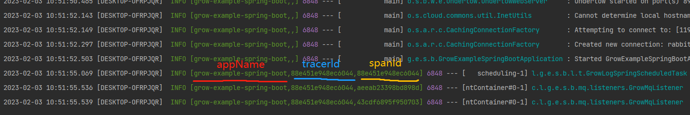

## 简介

Grow Log 是一个分布式链路追踪模块，其提供了多种不同的支持以满足不同性能和环境的需求。

目前支持实现方式：

- [spring-cloud-sleuth](https://github.com/spring-cloud/spring-cloud-sleuth)
- [tlog](https://github.com/dromara/TLog)

-------------------------------------------------------------------------------

## 如何使用

1. 引入相关依赖(根据需求选择)。

```xml
<dependencies>
    <!--若使用spring-cloud-sleuth作为底层，则需要引入-->
    <dependency>
        <groupId>com.liguanqiao</groupId>
        <artifactId>grow-log-sleuth-boot-starter</artifactId>
        <version>${latest.version}</version>
    </dependency>
    <!--若使用tlog作为底层，则需要引入-->
    <dependency>
        <groupId>com.liguanqiao</groupId>
        <artifactId>grow-log-tlog-boot-starter</artifactId>
        <version>${latest.version}</version>
    </dependency>
</dependencies>
```

2.  自定义logback.xml,按需配置root。

```xml
<?xml version="1.0" encoding="UTF-8"?>
<configuration>
    <!-- 控制台打印设置 -->
    <include resource="com/liguanqiao/grow/log/logback/defaults.xml"/>

    <root level="INFO">
        <!--带颜色的控制台日志-->
        <appender-ref ref="STDOUT_COLOR"/>
        <!--不带颜色的控制台日志-->
        <appender-ref ref="STDOUT"/>
        <!--异步打印不带颜色的控制台日志-->
        <appender-ref ref="ASYNC_STDOUT"/>
        <!--文件日志-->
        <appender-ref ref="FILE"/>
        <!--异步文件日志-->
        <appender-ref ref="ASYNC_FILE"/>
    </root>
</configuration>
```

3.  配置使用自定义logback.xml

```yml
logging:
  config: classpath:log/logback.xml
```

4.  启动项目查看日志打印



##  高级使用

1.  获取TracerSpan

```java
@AllArgsConstructor
public class DemoService {

    private final TracerContext tracerContext;
    
    public void demo(){
        //获取当前线程标签
        TracerSpan currentSpan = tracerContext.currentSpan();
        //生成下一个标签
        TracerSpan nextSpan = tracerContext.nextSpan();
        //覆盖当前线程标签
        tracerContext.joinSpan(nextSpan);
    }

}
```